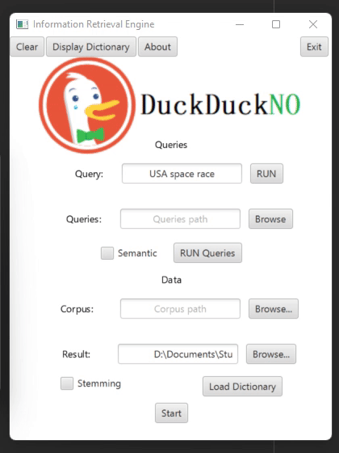
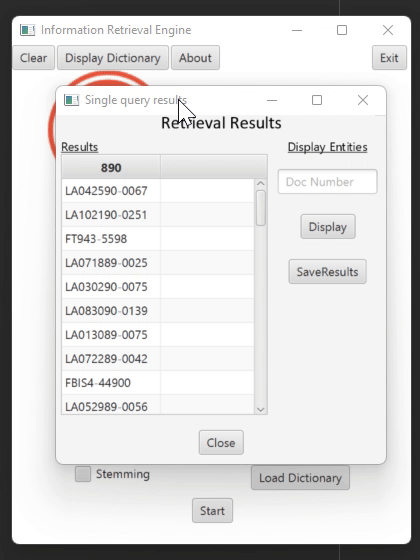

# Information Retrieval

This repository contains the tasks created as part of the Information Retrieval course at the Ben-Gurion University of the Negev. 

The course deals with a variety of subjects on Information Retrieval and its application on the Internet, digital libraries, and information science. 
It covers the following topics:
1. Classical topics: information retrieval models, information retrieval algorithms, indexing, data structures for information retrieval, and evaluation of information retrieval systems. 
2. Advanced topics: ranking methods, multimedia retrieval, thesaurus usage and creation, data mining, and harvesting. 
3. Information retrieval on the internet topics: digital libraries, basic and advanced search engines, electronic newspaper, and distance learning. 

## Information Retrieval Engine

  
  

Merav Shaked | Yiftach Savransky | [additional repo](https://github.com/yiftachsa/IR_engine_old)

The goal of this project is to apply the theoretical knowledge learned in the course and acquire practical knowledge of the development and evaluation of search engines. The project is implemented in Java using the Intellij environment. The project includes two programming phases – indexing and retrieving.

### Indexing the Documents (First Phase)

In this part we implement the processing and indexing of the documents. The corpus of documents includes approximately 450,000 documents, divided into around 1000 files. Files have fixed structure with XML style tags such as \<DOC\>, \<DOCNO\>, \<TEXT\>, etc.

Several project’s main classes of this part:
<ul>
  <li><ins>ReadFile class</ins> – Receives a path to the folder of the corpus, reads the files in it, and separates the documents.</li>
  <li><ins>Parser class</ins> – Separates every document to terms according to specific parsing rules regarding general words, numbers, dates and timestamps, entities, etc. All the entities that appear in more than one document are stored in a different index, dedicated to entities.</li>
  <li><ins>Stemmer class</ins> – Stemming is the process of reducing inflected (or sometimes derived) words to their word stem, base, or root form. This class is implemented using an open-source stemmer (Porter Stemmer).</li>
  <li><ins>Indexer class</ins> – Receives all the terms from the parser and creates an **inverted index**. The inverted index includes a dictionary of the terms and temporary posting files. To have the optimal time and space complexity, the writing to the disc occurs in batches of documents, instead of one by one.</li>
</ul>

### Retrieving Relevant Documents (Second phase)

In this part, we implement the search and retrieve framework. The search engine receives either a single query or a path to a file that contains multiple queries, and then it retrieves the most relevant documents that match the query.

Several project’s main classes of this part:
<ul>
  <li><ins>Searcher Class</ins> – Receives one or several queries and searches the documents in which the terms of the query appear.  The united list of documents for the query is then passed to the Ranker class for sorting them by their relevance. There is an option to return the top five entities according to their frequency in the document.</li>
  <li><ins>Ranker Class</ins> – Rates the relevance of each document to a given query. The score is computed using several different metrics: 
  <ol>
    <li><ins>BM25</ins> rank between the given query and the given document.</li>
    <li><ins>Jaccard Similarity</ins> between the query and document header.</li>
    <li><ins>DSC (Dice)</ins> between the query and the document entities.</li>
  </ol></li>
  <li><ins>Semantic Analyzer Class</ins> – Receives the query and adds semantically similar terms to it, each one being the most similar term to each of the terms in the query. This is done to retrieve relevant documents that don’t contain the terms in the query but contain terms with similar meanings. This is implemented using an open source word embedding model (Medallia Word2vec algorithm).</li>
</ul> 

